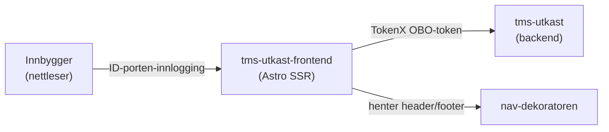

# tms-utkast-frontend

## Formålet med repoet

Dette er frontend-flaten som viser innbyggeres påbegynte utkast på Min side på nav.no. Hovedmålgruppen er innbyggere som er logget inn via ID-porten. Når brukeren åpner utkast-siden, henter appen listen over utkast og presenterer dem som lenkekort, slik at brukeren kan fortsette på en søknad eller et skjema de har startet på. Hvis brukeren ikke har noen utkast, vises en egen tom-tilstand, og ved feil mot backend vises en feilmelding.

Appen er en server-renderet Astro-app med React-øyer, og kjører bak nav-dekoratøren på `/minside/utkast`.

## Arkitektur

Innkommende forespørsler valideres i Astro-middleware (`src/middleware/index.ts`) med `@navikt/oasis`. Mot `tms-utkast` veksles brukerens token til et on-behalf-of-token via TokenX før utkast hentes.

## Miljøer

| Miljø | URL |
|---|---|
| Produksjon | https://www.nav.no/minside/utkast |
| Dev (intern) | https://www.intern.dev.nav.no/minside/utkast |
| Dev (ansatt) | https://www.ansatt.dev.nav.no/minside/utkast |

## Backend-referanse

### [tms-utkast](https://github.com/navikt/tms-utkast)

Leverer innbyggerens påbegynte utkast som vises på Min side.

- **GET** `/v2/utkast`

Kallet gjøres server-side med et TokenX OBO-token (audience `<cluster>:min-side:tms-utkast`).

## Utvikling

Lokalt nås appen på http://localhost:4321/minside/utkast, med en Hono-mockserver som spiller rollen til `tms-utkast`-backenden. I lokal modus hoppes innlogging og token-veksling over.

Tilgjengelige kommandoer (bygg, test, mock og kjøring) finner du med `pnpm run` — det viser den til enhver tid oppdaterte listen over `scripts` i `package.json`. Repoet bruker Node 24 og pnpm.

## For Nav-ansatte

Spørsmål knyttet til koden eller prosjektet kan stilles som issues her på GitHub. Interne henvendelser kan rettes til [#team-minside på Slack](https://nav-it.slack.com/app_redirect?channel=team-minside).
